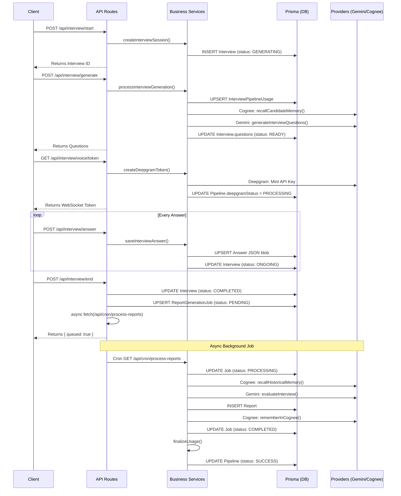
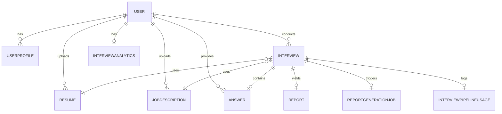

# Application Pipeline Execution Flow

This document provides a comprehensive, reverse-engineered architectural audit of the Clutchly Interview Memory Agent project.

## 1. High-level architecture

The application is built using Next.js App Router, using PostgreSQL (via Prisma) for data persistence. It relies on external providers: Clerk (Auth), Gemini (Question & Report Generation), Deepgram (Voice Agent), and Cognee (Semantic Graph Memory).
The core workload is centered around the Interview lifecycle: creating an interview, generating AI questions based on resume & job description, facilitating a live voice session, collecting transcripts, evaluating performance, and persisting memory back to a semantic knowledge graph to inform future interviews.

## 2. Folder architecture

- `app/api/**`: Next.js App Router endpoints handling client requests.
- `services/**`: Core business logic that interfaces with Prisma and external providers.
- `lib/**`: Utilities, configuration, prompt builders, pricing calculations, and logger.
- `prisma/schema.prisma`: Database definition.

## 3. Request lifecycle

1. **Client Request**: Initiated by the frontend.
2. **Authentication**: Handled via Clerk (`@clerk/nextjs/server`) verifying the session token.
3. **Validation**: API routes use `zod` for strict payload validation.
4. **Service Layer**: Business logic delegation to `services/`.
5. **Database/Providers**: Data reads/writes via Prisma; network calls to Gemini/Deepgram/Cognee.
6. **Response**: Uniform JSON responses (`{ success: true, data: ... }` or `{ success: false, error: ... }`).

## 4. Interview lifecycle

1. **Setup**: `POST /api/interview/start` -> Creates Interview in `GENERATING` status.
2. **Generation**: `POST /api/interview/generate` -> Recalls Candidate Memory (Cognee), builds prompt, calls Gemini, saves `questions` array. Flips status to `READY`.
3. **Session Active**: Client fetches questions. Deepgram token generated via `GET /api/interview/voice/token`.
4. **Answers Recorded**: As the user speaks, `POST /api/interview/answer` saves transcript chunks incrementally. Flips status to `ONGOING`.
5. **End Interview**: `POST /api/interview/end` -> Flips status to `COMPLETED`, stops Deepgram pipeline tracking, queues `ReportGenerationJob`, and fires background trigger.
6. **Evaluation**: `GET /api/cron/process-reports` runs async -> Evaluates performance (Gemini) -> Saves `Report` -> Saves semantic memory (Cognee) -> Marks Job `COMPLETED` -> Finalizes `InterviewPipelineUsage`.

## 5. Pipeline lifecycle

The `InterviewPipelineUsage` table tracks observability data for exactly one `Interview`.
- Created as `PENDING` during Question Generation initialization.
- **Question Generation**: Flips to `PROCESSING`, then `SUCCESS`/`FAILED`. Cost & tokens computed.
- **Deepgram**: Flips to `PROCESSING` at token minting. Flips to `SUCCESS`/`FAILED` at interview end. Cost & duration computed.
- **Report Generation**: Flips to `PROCESSING` in cron job. Flips to `SUCCESS`/`FAILED` upon Gemini evaluation.
- **Cognee Save**: Flips to `PROCESSING` during `persistInterviewMemory`. Flips to `SUCCESS`/`FAILED`.
- **Cognee Retrieval**: Flips to `PROCESSING` during prompt building (or `SKIPPED` if first interview). Flips to `SUCCESS`/`FAILED`.
- **Finalization**: `finalizeUsage()` is called by the cron job at the end. It ensures no stages are `PENDING`/`PROCESSING`, then writes the total pipeline cost, duration, and flips the master `pipelineStatus` to `SUCCESS`.

## 6. Database lifecycle

- `User` / `UserProfile`: Created upon Clerk onboarding webhook. Updated via profile edits.
- `Resume`: Created on upload. Never updated.
- `JobDescription`: Created implicitly during `/api/interview/start` if custom JD text provided.
- `Interview`: Created in `/start` (`GENERATING`). Updated in `/generate` (`READY`), `/answer` (`ONGOING`), `/end` (`COMPLETED`).
- `InterviewPipelineUsage`: Created in `/generate` (`PENDING`). Updated incrementally during pipeline stages. Finalized in cron (`SUCCESS`/`FAILED`).
- `Answer`: Created/Updated incrementally during `/answer` (upserted JSON blob).
- `ReportGenerationJob`: Created in `/end` (`PENDING`). Updated in cron (`PROCESSING` -> `COMPLETED`/`FAILED`).
- `Report`: Created at the end of the cron evaluation.

## 7. External provider lifecycle

**Clerk**
- Read via `auth()` helper to authenticate every API route.
- Writes sync via webhooks (User creation/deletion).

**Gemini**
- Read/Write: Question generation (`generateInterviewQuestions`). Input: Context prompt. Output: JSON questions.
- Read/Write: Report evaluation (`evaluateInterview`). Input: Q&A transcripts + historical context. Output: JSON evaluation report.

**Deepgram**
- Call: Token minting (`createDeepgramToken`) via `POST /v1/projects/{project}/keys`. Output: Temporary session token.

**Cognee**
- Call: `recallCandidateMemory` / `recallHistoricalMemory` via `/api/v1/recall`. Input: Semantic query. Output: Knowledge graph nodes.
- Call: `rememberInCognee` via `/api/v1/remember`. Input: JSON Blob of memory traits. Output: Dataset UUID.
- Call: `improveInCognee` via `/api/v1/improve`. Input: User ID.

## 8. Sequence diagrams (Mermaid)

## 9. API call graph

| Endpoint | Services Called | DB Read/Write | External Providers |
| :--- | :--- | :--- | :--- |
| `POST /api/interview/start` | `createInterviewSession` | `User`, `Resume` (R) / `JobDescription`, `Interview` (W) | Clerk (Auth) |
| `POST /api/interview/generate` | `processInterviewGeneration`, `prepareInterviewPrompt`, `initPipelineUsage` | `Interview` (R) / `PipelineUsage`, `Interview` (W) | Cognee, Gemini |
| `GET /api/interview/voice/token` | `createDeepgramToken`, `markDeepgramStart` | `Interview` (R) / `PipelineUsage` (W) | Deepgram |
| `POST /api/interview/answer` | `saveInterviewAnswer` | `Interview`, `Answer` (R) / `Answer`, `Interview` (W) | - |
| `POST /api/interview/end` | `ensureCompleted`, `finalizeDeepgram` | `Report`, `PipelineUsage` (R) / `Interview`, `ReportGenerationJob` (W) | - |
| `GET /api/cron/process-reports` | `evaluateInterview`, `saveReport`, `persistInterviewMemory`, `finalizeUsage` | `ReportGenerationJob`, `Report`, `Interview` (R) / `ReportGenerationJob`, `Report`, `PipelineUsage`, `Interview` (W) | Cognee, Gemini |

## 10. Service dependency graph

- `questionGenerator.service` depends on -> `promptBuilder.service`, `pipelineUsage.service`, Gemini
- `promptBuilder.service` depends on -> `cognee.service`, Gemini
- `interview.service` depends on -> `cognee.service`, `pipelineUsage.service`, Gemini
- `memory.service` depends on -> `memory-builder.service`, `cognee.service`
- `cron/process-reports` depends on -> `interview.service`, `report.service`, `memory.service`, `pipelineUsage.service`

## 11. Database relationship graph

## 12. Status transition diagrams

**Interview Status:**
`PENDING` -> `GENERATING` (at /start) -> `READY` (at /generate) -> `ONGOING` (at /answer) -> `COMPLETED` (at /end)
Alternative paths: `FAILED` (if generation errors), `CANCELLED`.

**Pipeline Stage Statuses (QuestionGen, Deepgram, ReportGen, CogneeSave, CogneeRetrieval):**
`PENDING` -> `PROCESSING` -> `SUCCESS` | `FAILED`
*Note: `CogneeRetrieval` can transition `PENDING` -> `SKIPPED` on first interviews.*

**Master Pipeline Status:**
`PENDING` -> `SUCCESS` | `FAILED` (handled only by `finalizeUsage()`)

**Report Job Status:**
`PENDING` -> `PROCESSING` -> `COMPLETED` | `FAILED`

## 13. Complete execution timeline

1. User clicks "Start Interview"
2. `POST /api/interview/start` called
3. `createInterviewSession()` verifies user quota with row-level lock.
4. `INSERT` into `Interview` table (status: `GENERATING`).
5. Client redirects to interview lobby, automatically calling `POST /api/interview/generate`.
6. `processInterviewGeneration()` locks in-flight requests.
7. `initPipelineUsage()` UPSERTs `InterviewPipelineUsage` row.
8. `recallCandidateMemory()` runs, tracking Cognee retrieval.
9. `generateInterviewQuestions()` calls Gemini, tracking input/output tokens.
10. `UPDATE` `Interview.questions` JSON blob (status: `READY`).
11. Client navigates to Voice UI.
12. `GET /api/interview/voice/token` fetches Deepgram token, tracking Deepgram start.
13. Client connects WebSocket to Deepgram. User speaks.
14. Client sends chunks to `POST /api/interview/answer`.
15. `saveInterviewAnswer()` UPSERTs `Answer` JSON array, updating Interview status to `ONGOING`.
16. User clicks "End Interview".
17. `POST /api/interview/end` flips Interview to `COMPLETED`, finalizes Deepgram stage.
18. `UPSERT` `ReportGenerationJob` (status: `PENDING`).
19. Fire-and-forget fetch to `GET /api/cron/process-reports`.
20. Endpoint immediately returns success to Client. Client redirects to report page.
21. (Background) `cron` fetches PENDING jobs, updates status to `PROCESSING`.
22. `evaluateInterview()` calls Cognee (historical) and Gemini (evaluation), tracking Report generation stage.
23. `saveReport()` INSERTs into `Report` table.
24. `persistInterviewMemory()` builds semantic graph, calls Cognee remember & improve, tracking Cognee Save stage.
25. `finalizeUsage()` asserts no stages are PENDING/PROCESSING, computes total cost, and marks pipeline `SUCCESS`.

## 14. List of all database writes in chronological order

1. `INSERT Interview` (status: GENERATING) - `/api/interview/start`
2. `INSERT JobDescription` (optional) - `/api/interview/start`
3. `UPSERT InterviewPipelineUsage` (status: PENDING) - `/api/interview/generate`
4. `UPDATE InterviewPipelineUsage` (Cognee Retrieval processing/success) - `/api/interview/generate`
5. `UPDATE InterviewPipelineUsage` (Gemini Question processing/success) - `/api/interview/generate`
6. `UPDATE Interview` (status: READY, questions: blob) - `/api/interview/generate`
7. `UPDATE InterviewPipelineUsage` (Deepgram processing) - `/api/interview/voice/token`
8. `UPSERT Answer` (answers: blob) - `/api/interview/answer` (repeated multiple times)
9. `UPDATE Interview` (status: ONGOING) - `/api/interview/answer` (repeated)
10. `UPDATE Interview` (status: COMPLETED) - `/api/interview/end`
11. `UPDATE InterviewPipelineUsage` (Deepgram success) - `/api/interview/end`
12. `UPSERT ReportGenerationJob` (status: PENDING) - `/api/interview/end`
13. `UPDATE ReportGenerationJob` (status: PROCESSING) - `/api/cron/process-reports`
14. `UPDATE InterviewPipelineUsage` (Report Generation processing/success) - `evaluateInterview`
15. `INSERT Report` - `saveReport`
16. `UPDATE InterviewPipelineUsage` (Cognee Save processing/success) - `persistInterviewMemory`
17. `UPDATE ReportGenerationJob` (status: COMPLETED) - `/api/cron/process-reports`
18. `UPDATE InterviewPipelineUsage` (status: SUCCESS, total pipeline calculations) - `finalizeUsage()`

## 15. List of every external API call

1. **Clerk `auth()`**: Verify session tokens (called on almost every protected API route).
2. **Cognee `/api/v1/recall`**: Semantic graph search (called by `promptBuilder.service` and `interview.service`).
3. **Gemini `generateContent`**: Generates interview questions (called by `questionGenerator.service`).
4. **Deepgram `POST /v1/projects/{id}/keys`**: Mints temp API key (called by `GET /api/interview/voice/token`).
5. **Gemini `generateContent`**: Evaluates interview transcript (called by `interview.service`).
6. **Cognee `/api/v1/remember`**: Saves candidate graph data (called by `memory.service`).
7. **Cognee `/api/v1/improve`**: Re-indexes graph datasets (called by `memory.service`).

## 16. List of every background process

1. **Fire-and-forget Cron Trigger**: At the end of `/api/interview/end`, a non-awaited `fetch` is fired to the cron endpoint.
2. **Cron Report Processing (`/api/cron/process-reports`)**: Automatically triggered by Vercel Cron or manual fire-and-forget. Reads `PENDING` rows, evaluates with Gemini, saves semantic memory, and finalizes usage. Re-queues on 429/503 errors via exponential backoff.
3. **`improveInCognee`**: Called inside `persistInterviewMemory`. This is a synchronous blocking network request, though logically functions as a background re-index step on the database side.

## 17. Potential architecture issues (without fixing)

- **Race conditions**: If the frontend double-fires `/api/interview/end`, the cron fire-and-forget could overlap. The cron job attempts to prevent this using idempotency checks (`existingReport`), but parallel cron invocations could potentially select the exact same `PENDING` job before the `PROCESSING` update lock commits.
- **Fire-and-forget writes**: The `fetch` call in `/api/interview/end` to the cron worker swallows rejections via `.catch()`. If the serverless instance drops the fetch before the network resolves, the cron process won't start immediately (it will wait for the standard cron schedule).
- **Missing transactions**: `persistInterviewMemory` calls Cognee `remember` and `improve`. If `improve` fails, the memory is already inserted into Cognee, but the pipeline metrics track it as a failure (or swallowed error depending on logging), leading to partial state in the semantic graph.
- **Missing error handling / early exits**: In `pipelineUsage.service`, all `updateStage` updates are best-effort wrapped in `try/catch`. If the database drops the connection, the metric is completely lost without retry, which can leave a stage stuck in `PENDING` indefinitely, breaking `finalizeUsage()`.

---

## Answer to Specific Question: InterviewPipelineUsage Update Behavior

**"Is InterviewPipelineUsage updated incrementally throughout the interview lifecycle, or is it only persisted after the entire pipeline completes?"**

**Answer**: `InterviewPipelineUsage` is **updated incrementally** throughout the entire lifecycle. 

The row is initially created at the start of Question Generation (`initPipelineUsage`). As each stage begins and ends, a specific helper function incrementally updates the row via `updateStage()`. 

**Code Path Evidence**:
- When questions are generating: `markQuestionGenerationStart` updates `questionGenerationStatus` to `PROCESSING`. `markQuestionGenerationSuccess` updates it to `SUCCESS` and records token metrics.
- When Deepgram token is minted: `markDeepgramStart` updates `deepgramStatus` to `PROCESSING`.
- When interview ends: `finalizeDeepgram` updates `deepgramStatus` to `SUCCESS` and records cost.
- During evaluation: `markReportGenerationStart` -> `SUCCESS`.
- During memory saving: `markCogneeSaveStart` -> `SUCCESS`.

Only the **master pipeline row fields** (`totalPipelineCostUsd`, `totalPipelineDurationMs`, and `pipelineStatus`) are persisted at the very end via the `finalizeUsage()` call inside the background cron process. `finalizeUsage()` relies on checking the incrementally updated stage fields to ensure none are left `PENDING` or `PROCESSING` before it seals the pipeline as `SUCCESS`.
